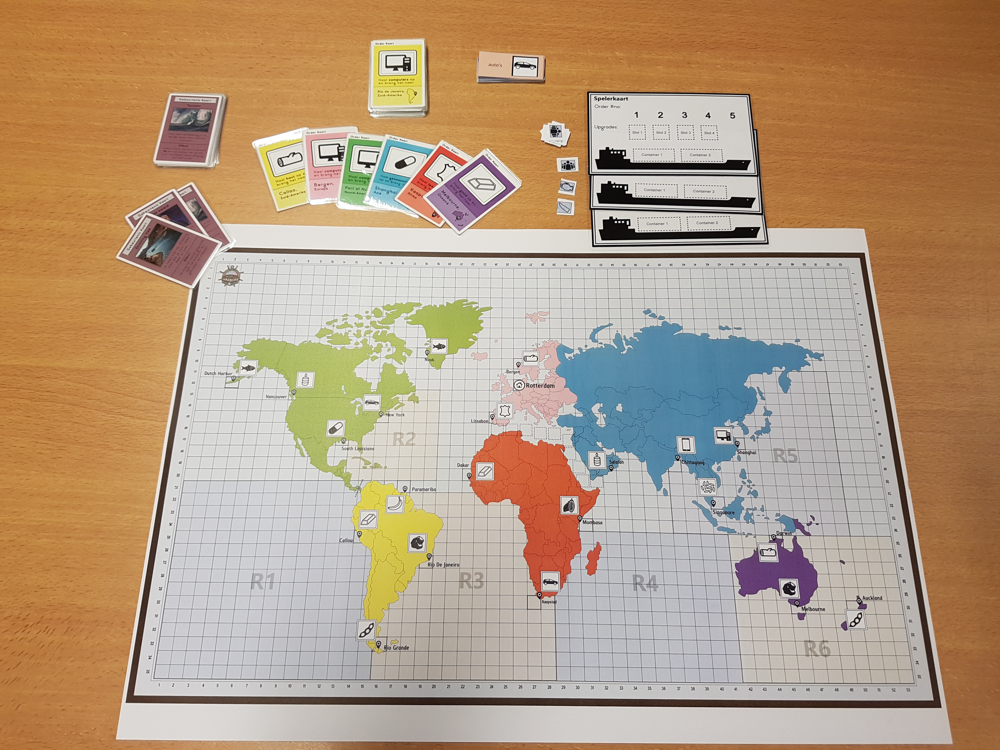

World of Harbors is a game that has been made during the first project of year one(2016) with a small group of students.

World of Harbors is a strategic boardgame that is played on a world map. The players start at Rotterdam and the goal is to be the first player to get five points and sail back to Rotterdam. The players move their pawn over the squares of the board with the number of eyes from the rolled dice. You can only walk across the board horizontally and vertically. An event card may be drawn as soon as there is a double throw. Points are earned by paying order cards, one point for each order card. To pay for an order card you must pick up the export product indicated on the card and then deliver it to the indicated port. To determine who can start first, one die is rolled. The player with the highest number of eyes is allowed to start, then the game continues clockwise. 